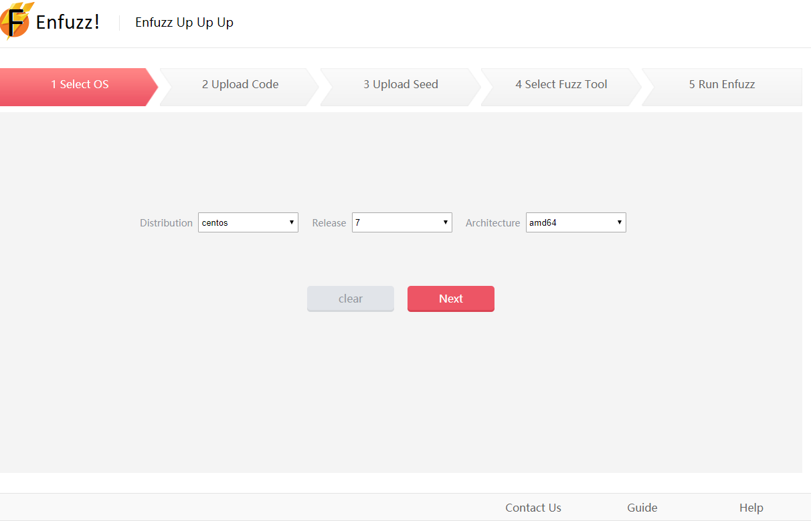
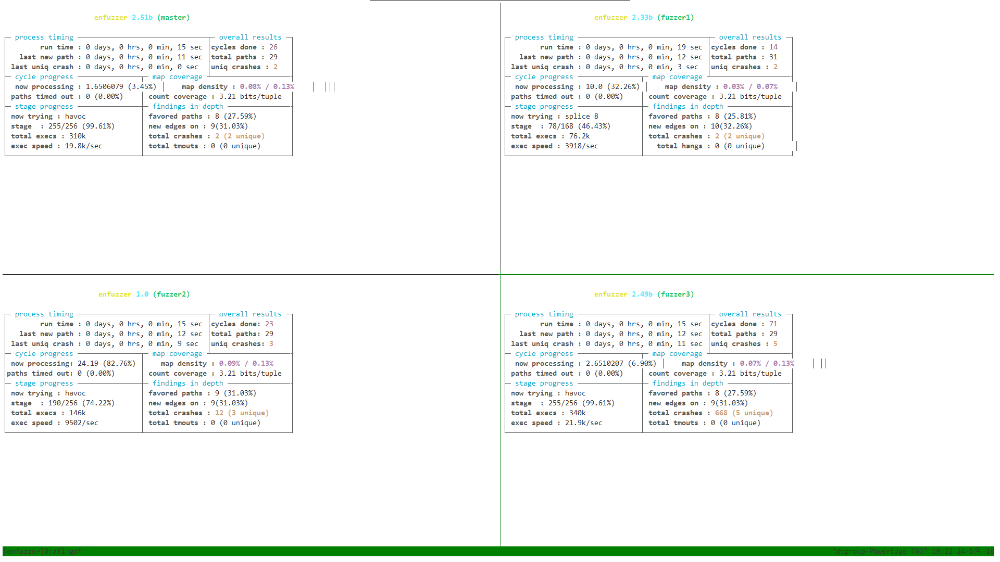

# EnFuzzer

Tool for ensemble fuzzing, it works across most Linux distributions. So far, Enfuzzer has passed all the testcases and worked well on ubuntu, archlinux, centos, debian, fedora, gentoo and opensuse.

The latest version of enfuzzer was moved to http://wingtecher.com/Enfuzz/.



The detail use of Enfuzz Server can be found in https://github.com/enfuzz/enfuzz/blob/master/user.md.


## Install
To install our EnFuzzer, you can just execute in shell:
```sh
./install
```

Arch Linux and Ubuntu 16.04 are tested, but it should work on other Linux distributions. Please configure the `PATH` environment variable in your shell first, to include `/opt/enfuzzer/`.

Execute in shell:

```sh
export PATH="/opt/enfuzzer:$PATH"
```


Or you can directly insert the content above in configuration files such as `~/.bashrc`.

## Install library for GSYM
```sh
# disable ptrace_scope for PIN
$ echo 0|sudo tee /proc/sys/kernel/yama/ptrace_scope

# install z3 and system deps
$ cd /opt/enfuzzer/bin/qsym
$ ./setup.sh

# install using virtual env
$ virtualenv venv
$ source venv/bin/activate
$ pip install .
```

### Configure and Build

Enfuzzer also provide a easy used interface for building process, you can build your project by execute in shell:
```sh
Enfuzzer-host build -gz xxx.tar.gz
```
then it will automatically build three binary — one pure binary with no instrumentation for Radamsa; one binary built with afl-gcc for AFL; one binary built with sanitizer for libFuzzer.

You can also build your project manually. 
The build stage of target application for afl-fuzz is easy and totally the same as AFL, which can be completed with afl-gcc.
The build stage of target application for libfuzzer is easy too, which can be completed with libfuzzer.a.
The build stage for pure binary with no instrumentation is the same as normal build stage of target application.


### Start fuzzing

#### Seeds preparation

After building target application, you can use EnFuzzer for fuzzing. Before it, you need to prepare initial seeds for fuzzing, execute in shell:
```sh
Enfuzzer-host seed -gz seed.tar.gz
```

#### Direct invocation

You need to have `tmux` installed (`sudo apt-get install tmux`), then execute:

```sh
EnFuzzer-host run -t [fuzzingTime]
```



## more usage about Enfuzz， execute in shell:
```sh
Enfuzzer-host
[!] Usage
     Enfuzzer-host run -a(AFL), -l(libfuzzer), -f(aflfast), -I(intefuzz), -i(fairfuzz), -r(radamsa), -q(qsym), -t time(s)
     Enfuzzer-host build -zip XXX.zip or –gz XXX.tar.gz
     Enfuzzer-host seed -zip XXX.zip or –gz XXX.tar.gz
     Enfuzzer-host env -n name –d Distribution-r RELEASE -a ARCH
     Enfuzzer-host file -n name -f file -d / 
     Enfuzzer-host start -n name
     Enfuzzer-host close -n name
     Enfuzzer-host destroy -n name
     Enfuzzer-host execute -n name -i "shell script"
     Enfuzzer-host copy -n name -d Distribution
     Enfuzzer-host check-env -n name
     Enfuzzer-host check-build -n name
     Enfuzzer-host check-seed -n name
     Enfuzzer-host check-run -n name
     Enfuzzer-host check-destroy -n name
```


